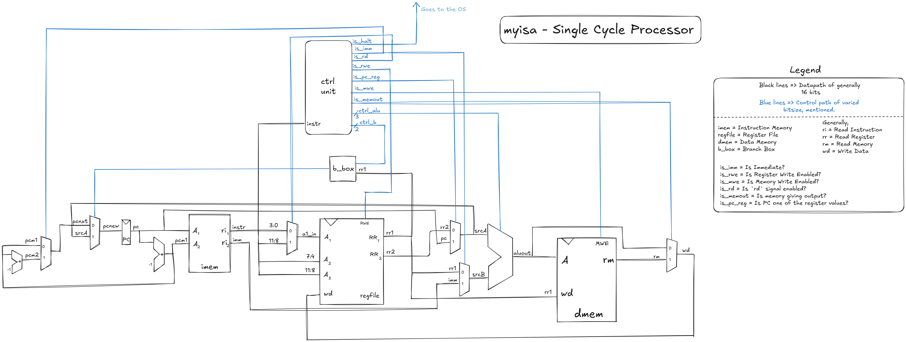

# `myisa`
My ISA.

This is a project taken upon myself to design an ISA(Instruction Set Architecture).
For my design choices, I selected 16-bit architecture(for simplicity) and played around with some unique ideas, such as
having immediate values stored in a separate word. Hence, I make full utilization of the 16 bits per word.
This has primarily been inspired from MIPS, IAS and RISC V ISAs.

## Diagrams

#### Single Cycle

#### Basic Pipeline(no hazards fix)

#### Pipeline with forwarding

#### Pipeline with forwarding and stalls

#### Pipeline with forwarding, stalls and control hazard fix

## ISA
The specifcations of the ISA can be found in the [Architecture](./ARCH.md) file. Please refer that.
Here is a table with all the instructions implemented.

| Opcode | Instruction | Explanation |
| :----: | :---------- | :---------- |
| `0000` | `lw r1, r2` `imm` | Loads the word `imm(r2)` into `r1`. |
| `0001` | `sw r1, r2` `imm` | Stores the value of the register `r1` into `imm(r2)`. |
| `0010` | `nand r1, r2, r3` | Stores the value of `NAND(r2, r3)` into `r1` |
| `0011` | `nandi r1, r2` `imm` | Stores the value of `NAND(r2, imm)` into `r1` |
| `0100` | `add r1, r2, r3` | `r1 = r2 + r3` |
| `0101` | `addi r1, r2` `imm` | `r1 = r2 + imm` |
| `0110` | `sub r1, r2, r3` | `r1 = r2 - r3` |
| `0111` | `mul r1, r2` | Stores the most significant 16 bits of `r1*r2` into `hi` and the least significant bits into `lo`|
| `1000` | `div r1, r2` | `hi = r1/r2` (integer division), `lo = r1%r2`(remainder) |
| `1001` | `cmp r1, r2` | Sets the `flg` register with the required value. |
| `1010` | `b r1` | Sets the `pc` to whatever value is in `r1` |
| `1011` | `beq r1` | Sets `pc = r1` if `flg.eq == 1` |
| `1100` | `bgt r1` | Sets `pc = r1` if `flg.gt == 1` |

I am restricted mainly by the number of instructions that I can include in my ISA, since I restrict the opcode to be 4 bits.

## Implementations

As of writing this README, I've implemented this ISA through [C code](./c_impl) and in a [single cycle](./single_cycle) organisation.
I'm currently working on making this pipelined, with some _advanced_ microarchitectural principles as well(like branch predictor, superscalar,
out of order execuction, etc).

## Sources
- [Harris and Harris: **Digital Design and Computer Architecture**](https://unidel.edu.ng/focelibrary/books/Digital%20Design%20and%20Computer%20Architecture%20(Harris,%20Sarah,%20Harris,%20David)%20(Z-Library).pdf)(2nd edition)
- [Henessay and Patterson: **Computer Architecture: A Quantitative Approach**](https://www.eng.biu.ac.il/~wimers/files/courses/Computer_Structure_and_Architecture/Books/Hennessy%20%20Patterson%204th%20Eddition.pdf)(4th edition)
- [Shen and Lipasti: **Modern Processor Design: Fundamentals of Superscalar Processors**](https://acs.pub.ro/~cpop/SMPA/Modern%20Processor%20Design_%20Fundamentals%20of%20Superscalar%20Processors%20(%20PDFDrive%20).pdf)
