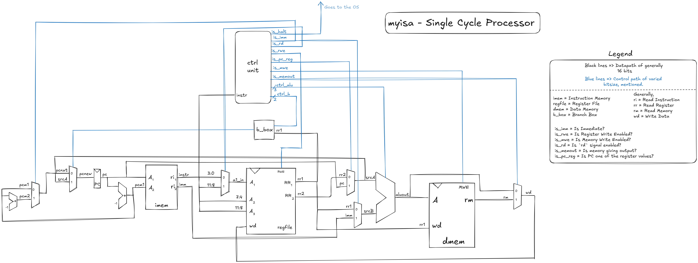

# `myisa`
My ISA.

This is a project taken upon myself to design an ISA(Instruction Set Architecture).
For my design choices, I selected 16-bit architecture(for simplicity) and played around with some unique ideas, such as
having immediate values stored in a separate word. Hence, I make full utilization of the 16 bits per word.
This has primarily been inspired from MIPS, IAS and RISC V ISAs.

## Diagrams

#### Single Cycle


#### Basic Pipeline(no hazards fix)


#### Pipeline with forwarding, stalls and control hazard fix


## Directory Structure

This is the output of `tree` or(`eza -T`).

<details>
<summary> Complete directory structure </summary>
<br>


```
.
├── ARCH.md
├── c_impl
│   ├── assembler.c
│   ├── computer.c
│   └── README.md
├── fpga
│   ├── constrs_1
│   │   └── imports
│   │       └── projects
│   │           └── Nexys4DDR_Master.xdc
│   ├── pics
│   │   ├── FPGA_hw_connections.svg
│   │   └── FPGA_proc.svg
│   ├── README.md
│   ├── sources_1
│   │   ├── imports
│   │   │   ├── sources_1
│   │   │   │   ├── imports
│   │   │   │   │   ├── decoder_generic.v
│   │   │   │   │   ├── hex2sseg.v
│   │   │   │   │   ├── mux_8x1_nbit.v
│   │   │   │   │   ├── sseg_driver.v
│   │   │   │   │   ├── terminal_demo.v
│   │   │   │   │   ├── timer_input.v
│   │   │   │   │   ├── uart.v
│   │   │   │   │   ├── uart_rx.v
│   │   │   │   │   └── uart_tx.v
│   │   │   │   ├── new
│   │   │   │   │   └── FIFO_ByteToWord_Controller.v
│   │   │   │   └── README.md
│   │   │   └── src
│   │   │       ├── alu.sv
│   │   │       ├── button.sv
│   │   │       ├── ctrl_unit.sv
│   │   │       ├── hazard_unit.sv
│   │   │       ├── hex_to_7seg.sv
│   │   │       ├── mainmem.v
│   │   │       ├── memory.mem
│   │   │       ├── old_top.sv
│   │   │       ├── other
│   │   │       │   ├── assembler.c
│   │   │       │   ├── fibo.asm
│   │   │       │   ├── guess_number.asm
│   │   │       │   ├── multiplication.asm
│   │   │       │   └── temp.asm
│   │   │       ├── pipeline_regs.sv
│   │   │       ├── proc.sv
│   │   │       ├── regfile.sv
│   │   │       ├── tools.sv
│   │   │       └── top.sv
│   │   └── ip
│   │       ├── fifo_generator_0
│   │       │   └── fifo_generator_0.xci
│   │       └── fifo_generator_1
│   │           └── fifo_generator_1.xci
│   └── uart_esp.ino
├── LICENSE
├── pipelined
│   ├── assembler.c
│   ├── diagrams
│   │   ├── myisa_pipelined_basic.png
│   │   ├── myisa_pipelined_ctrl.png
│   │   ├── myisa_pipelined_ctrl_hazard_fix.png
│   │   ├── myisa_pipelined_fwd.png
│   │   └── myisa_pipelined_stall.png
│   ├── README.md
│   └── src
│       ├── alu.sv
│       ├── ctrl_unit.sv
│       ├── dmem.sv
│       ├── hazard_unit.sv
│       ├── imem.sv
│       ├── mainmem.sv
│       ├── pipeline_regs.sv
│       ├── regfile.sv
│       ├── tb_proc.sv
│       ├── tools.sv
│       └── top.sv
├── README.md
├── single_cycle
│   ├── assembler.c -> ../pipelined/assembler.c
│   ├── img.jpg
│   ├── myisa_single_cycle.png
│   ├── README.md
│   └── src
│       ├── alu.sv
│       ├── ctrl_unit.sv
│       ├── dmem.sv
│       ├── imem.sv
│       ├── regfile.sv
│       ├── tb_proc.sv
│       ├── tools.sv
│       └── top.sv
└── tests
    ├── allcmds.asm
    ├── division.asm
    ├── fact.asm
    ├── fibo.asm
    ├── largest_num.asm
    ├── multiplication.asm
    └── test.asm
```

</details>

We have a LICENSE, README and ARCH in the root directory.

The `c_impl` directory has the assembler and computer, along with its README, and a bunch of generated files(executable `assembler`, `computer`, `output.bin`).

The `single_cycle` directory has all the necessary files(and a couple of generated files) to run the single cycle processor.
The single cycle also has the processor diagram along with it(and its excalidraw file).
The instructions are in the README. Note that the assembler for pipelined and single cycle processors are same, and are hence symlinked.

The `pipelined` directory is built similarly, but it has a couple more SystemVerilog files, because of hazard fixes and pipelines.
Finally, the `tests` directory basically has a bunch of `myisa` assembly files.

The `fpga` directory is built with Vivado in mind. It contains the `sources_1` and `constr_1` directories as prompted by Vivado.
It also contains the arduino `.ino` file required for the ESP32.
The README in that directory explains all there is to what I've done there.

## ISA
The specifcations of the ISA can be found in the [Architecture](./ARCH.md) file. Please refer that.
Here is a table with all the instructions implemented.

| Opcode | Instruction | Explanation |
| :----: | :---------- | :---------- |
| `0000` | `lw r1, r2`<br>`imm` | Loads the word `imm(r2)` into `r1`. |
| `0001` | `sw r1, r2`<br>`imm` | Stores the value of the register `r1` into `imm(r2)`. |
| `0010` | `nand r1, r2, r3` | Stores the value of `NAND(r2, r3)` into `r1` |
| `0011` | `nandi r1, r2`<br>`imm` | Stores the value of `NAND(r2, imm)` into `r1` |
| `0100` | `add r1, r2, r3` | `r1 = r2 + r3` |
| `0101` | `addi r1, r2`<br>`imm` | `r1 = r2 + imm` |
| `0110` | `sub r1, r2, r3` | `r1 = r2 - r3` |
| `0111` | `mul r1, r2` | Stores the most significant 16 bits of `r1*r2` into `hi` and the least significant bits into `lo`|
| `1000` | `div r1, r2` | `hi = r1/r2` (integer division), `lo = r1%r2`(remainder) |
| `1001` | `cmp r1, r2` | Sets the `flg` register with the required value.(`1` if equal, `2` if `r1` greater than `r2`) |
| `1010` | `b r1` | Sets the `pc` to whatever value is in `r1` |
| `1011` | `beq r1` | Sets `pc = r1` if `flg.eq == 1` |
| `1100` | `bgt r1` | Sets `pc = r1` if `flg.gt == 1` |

I am restricted mainly by the number of instructions that I can include in my ISA, since I restrict the opcode to be 4 bits.
Note that `mul` and `div` instructions are not yet implemented in `myisa` pipelined version(nor in the FPGA verision).
However, I've written `myisa` programs to perform multiplication and division through repeated addition and subtraction.
This obviously takes many many more clock cycles than if I'd just directly implemented it.

## Implementations

As of writing this README, I've implemented this ISA(as simulations) through [C code](./c_impl), a [single cycle](./single_cycle) and a [pipelined](./pipelined) organisation.
I've also implemented it in an [FPGA](./fpga) using the NexysA7 Digilent board(Artix-7 FPGA chip).

## References
- [Harris and Harris: **Digital Design and Computer Architecture**](https://unidel.edu.ng/focelibrary/books/Digital%20Design%20and%20Computer%20Architecture%20(Harris,%20Sarah,%20Harris,%20David)%20(Z-Library).pdf)(2<sup>nd</sup> edition)
- [Henessay and Patterson: **Computer Architecture: A Quantitative Approach**](https://www.eng.biu.ac.il/~wimers/files/courses/Computer_Structure_and_Architecture/Books/Hennessy%20%20Patterson%204th%20Eddition.pdf)(4<sup>th</sup> edition)
- [Shen and Lipasti: **Modern Processor Design: Fundamentals of Superscalar Processors**](https://acs.pub.ro/~cpop/SMPA/Modern%20Processor%20Design_%20Fundamentals%20of%20Superscalar%20Processors%20(%20PDFDrive%20).pdf)
- [Weste and Harris: **CMOS VLSI Design: A Circuits and Systems Perspective**](https://vlsiworlds.com/wp-content/uploads/2021/04/cmos-vlsi-design-by-weste.pdf)
- References specific to the FPGA implementation is cited [here](https://github.com/kajuburfi/myisa/tree/master/fpga#resources-and-references)
