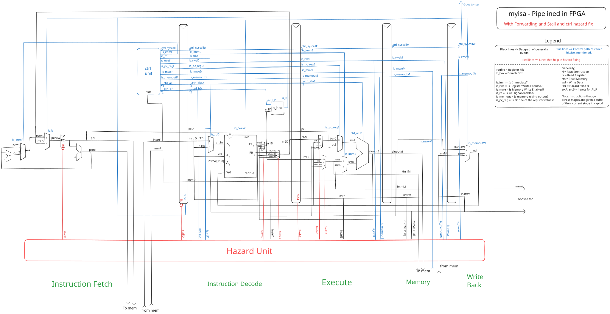
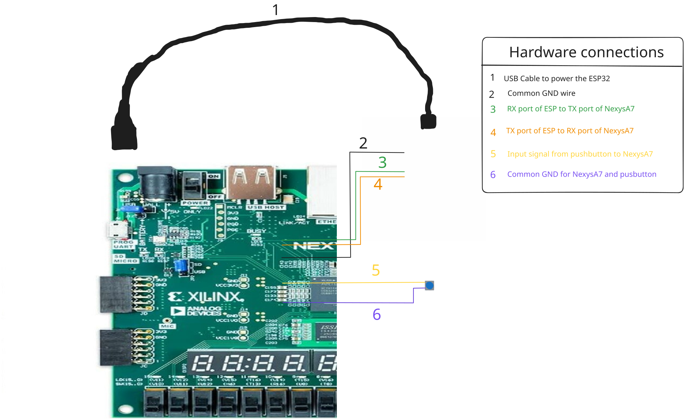

# Pipelined `myisa` processor on an FPGA!

This directory houses the source code written to put `myisa` on an FPGA.
Board Used: [Nexys A7](https://digilent.com/reference/_media/reference/programmable-logic/nexys-a7/nexys-a7_rm.pdf).
FPGA Chip in the Nexys A7 is the Artix 7. Along with an [ESP32](https://www.espressif.com/en/products/socs/esp32).

The processor design is more or less the same. The `top` file was remade from scratch, since in the previous
(pipelined) version, I assumed a simulation and wrote the testbench accordingly.
Now, we have full access to the memory, and can look through and edit the memory using the hardware on the Nexys A7 board.
I use the Buttons, switches and the 8 seven-segment LED displays to scroll through and edit the memory.
I also have connected an external ESP32 module through UART to the NexysA7, allowing for ease of communication between myisa
and the user.

All the programs that could be run on the simulation can also be done here. Along with some others as well.

## Schematics

#### The processor

The processor remains more or less the same. The only significant changes are as follows:

- Removed the `imem` and `dmem` modules. The wires now head into and out of `top`, where it is then re-routed to the memory.
- Added two wires - `instrW` and `immW` that lead to the `top`; They given as outputs to the processor, and used in `top`.
- Added two new _instructions_: `print` and `printmem`; these are used to print ASCII values through UART to the webpage handled by the ESP32 module.

#### The hardware connections

This diagram shows the wires between the ESP32 and the NexysA7. An extra pushbutton is also added, for ease of use.

## Setup

Steps: (follow from any reliable source)
- Install Vivado IDE through AMD's webpage.(I'm using version 2025.2)
- Download the Digilent files for the NexysA7-100T board.
- Open a new project, and copy the `constr_1/` and `sources_1/` directories. You may need to re-make the IP for the FIFO through a wizard in Vivado.
- Program your ESP32 module(after filling in the details of your internet SSID and it's password in the file) with the given [esp file](./uart_esp.ino).
- Following the instructions from [`pipelined/`](../pipelined/), generate the `memory.mem` file for whichever program you want to run using `./assembler`.
- Connect the board and esp32 and the pushbutton according to the schematic mentioned above.
- _Generate Bitstream_, and flash it to the NexysA7 board.

## UI/UX

### General Usage

Since we have limited resources at our hand, I had to make several choices regarding UI/UX. Hopefully the choices I've made make sense to you as well.
Initially, just after flashing, given that you've correctly made the `memory.mem` file(i.e. you've written correct code that doesn't end up in infinite loops),
we should be able to see the two RGB LEDs with a static green color. This indicates that the processor has finished processing, and you can now view the results.

The way I've structured things is as follows: We have 2 blocks of 4 digit seven-segment displays. The left block displays either the current memory location(`0000`),
or if you've inputted anything using the switches, you will see that. We can differentiate by the decimal pointers. If the decimal pointers are active(you see
the 4 decimal points), what you see is the memory location. The right block always displays the memory content in that particular memory slot. We can scroll
through the memory(all 4096 slots of them) using the UP and DOWN buttons on the NexysA7 board. As expected, UP moves the memory slot by one. So, when we start out from
`0000`, and press UP, we get `0FFF`, which is the _last_ memory slot. Here, we can also see the first instruction in the right block of the seven segment display.
Similarly, we can keep pressing up and down to scroll through the memory.

Now, say we want to _write_ to memory. How would we do that? Using the 16 switches, we can set a binary number. This will be displayed in the left block.
Note that as the switch value is non-zero, we can see the value, as well as the decimal pointers being inactive(you can't see them lit up). Each LED above each switch
will light up if that switch is active. Hence, you see two indicators of your input. Now, once you've finalized what 16-bit hex value you want to enter in that particular
memory slot, you can press the CENTRE button. The memory slot is now updated, and you can put all your switches back to zero, which will result in the memory location begin
shown again. Let's say that you're currently in the process of making the hex value, and some switches are active, but you want to see where in the memory you are.
You can press and hold on the RIGHT button to momentarily see what memory location you are at. Once you let go of the right button, you will see what you're entering once again.
This always holds true. You can, at any time, press the RIGHT button to view the current memory location.

Now, I want to go to a particular memory location, say `0200`. I'm not going to waste my time pressing the DOWN button 512 times! Instead, I can "make" the value I want
to go to in the left seven segment display block by using the switches, and instead of pressing the CENTER button(which would write that to the current memory location),
I'll press the LEFT button, which will take me to that memory location. As I'm pressing the LEFT button, you'll see all 8 decimal points light up, indicating my "jump" to
a particular memory location.

You now have, at your hands, the usage of the 5 buttons arranged in a _plus_ shape on the NexysA7 board. I now want to re-run(execute) my program, written in `myisa`
once again. I can do that by pressing the *red* CPU_RESET button. As I press this, we can see that the two green lights have disappeared, and will reappear in just
a few milliseconds(assuming your program is accurate). Congratulations! You just executed the program once again. This is really useful in certain contexts, such as
in my [guess the number](./sources_1/imports/src/other/guess_number.asm) game.

Now, for the fun part; using the UART communications and the webpage!

### Usage of the ESP module

Along with the FPGA, we've connected an ESP32 module and an external pushbutton. When we've powered on our NexysA7 board, the red LED in the esp should've also lit up.
This indicates that the webserver is up and running. You can now go to the respective IP address(which would've shown up in the serial monitor when programming your esp)
and view the webpage that allows UART communication between this webpage and the NexysA7 board. You'll see two sections, "Send Data" and "Receive Data".

The "Send Data" part works like this: I can input one or more 4 digit(hex) values to be sent to my FPGA. Once I send it, the textarea will clear, and my FIFO
(First In, First Out) input buffer will be populated with those values. Also, the blue LEDs(part of the rgb LEDs) will also light up, giving a cyan color(when the
processor has finished processing). This lets you know that the buffer is not empty. Further, the first value of that buffer(the _top_) will be visible, both on the LEDs
above the switches, and in the left seven segment display block. Now, the all other buttons work as intended. We can press and hold the right button to temporarily
view the memory location. We can press the center button to write that particular value to the currently memory slot. We can also press up and down to scroll through memory.

Now, once we have the buffer populated, we can press the external button to go through the FIFO. Pressing it once removes the current (2 byte or 1 word) element from the
left block, and we see the next one(in order of what we've sent). We can similarly do the same operations. Following the same, we can keep pressing the external
button till we clear the FIFO buffer.

Now, to make this more interesting, I've designed several "modes" of operation for the external button.
If we connect that yellow wire(the one carrying the signal), to the second port(i.e. JB\[2\]), we can now use it for a different functionality.
Generally, the "Receive Data" part in the webpage is used by the program, to _print_ bytes on to that textarea. However, now that we've changed the "mode" of operation
of the external button, we can now print bytes directly. Pressing the button sends a byte equivalent to whatever data is represented by the least significant switches
through the UART port, to be displayed on the webpage. We can send single bytes encoded in 2 digit hex using this.

The third mode implemented activates when we connect that yellow wire to the third port(JB\[3\]). This is essentially used to simplify re-programming the processor.
Which works as thus: We can get the machine code(in order) after running the `./assembler`, by using `tac memory.mem | less`. This reverses the memory file, and
puts the output into a pager. We can now manually copy the byte code till we see `FFFF`, and paste that into the "Send Data" pane. We can now send this.
We traverse to memory location `0FFF`. Now, the FIFO buffer(maximum capacity of 1024 words) is populated with the new program. Pressing the external button connected
to JB\[3\] does three actions at once: (1) writes the current word into memory, (2) moves the memory location up by one(does memory location - 1) and (3) goes to the
next element in the FIFO buffer. Now, it's easier to program the processor with new codes by just spamming the external button.
I could've indeed just made this one button press(to write the whole thing to memory), but instead chose to do this step by step, since it would hopefully avoid
some accidental issues as we can see what memory location we're writing to in real time.

## Resources and References

Here are some wonderful resources I made use of in the creation of this project.
- Anas Salah Eddin's [Youtube Course](https://www.youtube.com/@anassalaheddin1258/courses) series and his [GitHub](https://github.com/aseddin).
  Both are excellent resources for anything related to the NexysA7 board. His basic Digital Design and his Advanced Digital design courses are wonderous.
- Relating to the ESP32, I majorly referred to [Random Nerd Tutorials](https://randomnerdtutorials.com/getting-started-with-esp32/).
- Multiple *.stackexchange.com websites and several arduino forums were immensely helpful.
- [This](https://community.element14.com/technologies/fpga-group/b/blog/posts/arty-s7-50-how-to-store-microblaze-program-in-the-quad-spi-flash-memory-from-vivado) very specific,
  detailed tutorial on how to store a bitfile _permanently_ in the NexysA7's flash memory so that it loads automatically every time(given the jumpers are placed correctly).
  It's insane that I didn't get any other reliable source on the internet for this exact procedure. This works for the NexysA7, even though it is modelled for an ArtyS7.
- The Digilent NexysA7 board [Refernce Manual](https://digilent.com/reference/_media/reference/programmable-logic/nexys-a7/nexys-a7_rm.pdf).
