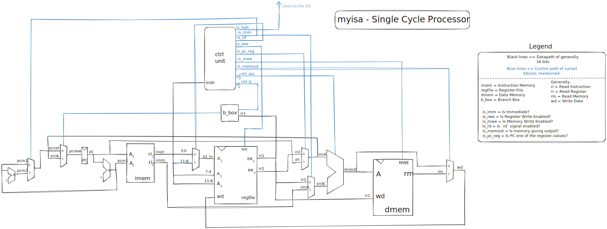

# Single Cycle implementation of `myisa`

In this directory is the source code for the SystemVerilog HDL of a single-cycle implementation of `myisa`.
The circuit diagram for the processor is given here.

I will not intensively document this portion, since the main one would be the pipelined processor for `myisa`.
It is to be noted, however, that the instructions `mul` and `div` have not been implemented.
They are commented out in the ALU, since they are not directly synthesizable. 
